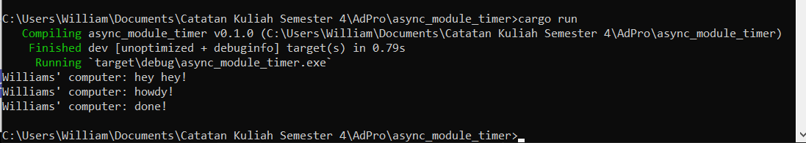

# Reflection

## 1.2 Understanding how it works

Disini, ketika kita menambahkan println setelah baris kode spawner.spawn(...), ternyata pesan yang diprint terlebih dahulu adalah yang berada setelah spawner.spawn(...) tersebut. Hal ini dapat terjadi karena di dalam spawner.spawn(...) terdapat fungsi asynchronous sehingga ketika spawner.spawn(...) dijalankan, fungsi yang di dalamnya perlu untuk menunggu hasil dari asinkronusnya tersebut, sedangkan untuk println hey hey tersebut berada di main program diluar fungsi asynchronous sehingga tidak perlu menunggu hasil apa apa dan dapat langsung dijalankan. Oleh karena itu, fungsi di dalam spawner.spawn walaupun dipanggil lebih dulu, fungsi diluar spawner.spawn itu akan ditampilkan terlebih dahulu sambil menunggu fungsi di dalam spawner.spawn(...) selesai dijalankan.