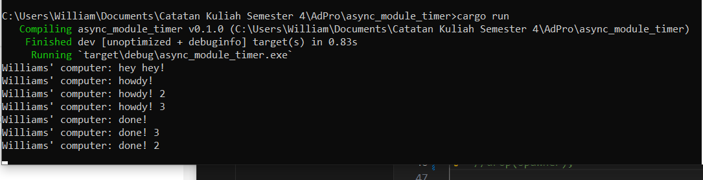
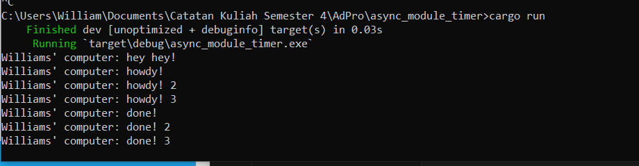
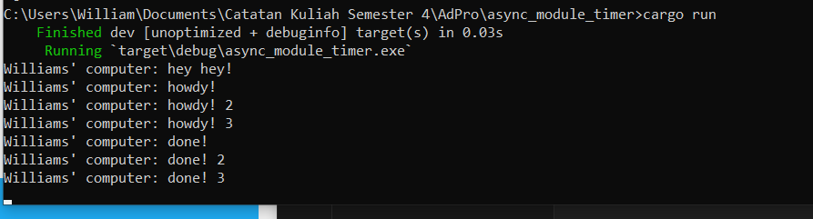

# Reflection

## 1.2 Understanding how it works

Disini, ketika kita menambahkan println setelah baris kode spawner.spawn(...), ternyata pesan yang diprint terlebih dahulu adalah yang berada setelah spawner.spawn(...) tersebut. Hal ini dapat terjadi karena di dalam spawner.spawn(...) terdapat fungsi asynchronous sehingga ketika spawner.spawn(...) dijalankan, fungsi yang di dalamnya perlu untuk menunggu hasil dari asinkronusnya tersebut, sedangkan untuk println hey hey tersebut berada di main program diluar fungsi asynchronous sehingga tidak perlu menunggu hasil apa apa dan dapat langsung dijalankan. Oleh karena itu, fungsi di dalam spawner.spawn walaupun dipanggil lebih dulu, fungsi diluar spawner.spawn itu akan ditampilkan terlebih dahulu sambil menunggu fungsi di dalam spawner.spawn(...) selesai dijalankan.

## 1.3 Multiple Spawn and removing drop

Disini, kita menambahkan 2 buah spawner baru dan menghapus baris kode "drop(spawner)". Penghapusan kode drop(spawner) menyebabkan program tidak bisa berhenti dengan sendirinya karena executor akan masih menunggu task yang akan muncul sehingga memang diperlukan drop(spawner) untuk memberi info kepada executor bahwa task sudah selesai. Kemudian, yang menarik dari multiple spawn adalah untuk howdy selalu diprint secara berurutan, yaitu howdy, howdy2 dan howdy3. Yang berbeda adalah urutan print dari down dapat berbeda, misalkan pada gambar 1 urutannya adalah down, down3, dan down2, sedangkan pada gambar 2 urutannya adalah down, down2, dan down3. Hal ini dapat terjadi karena fungsi asinkronus ketika sudah dijalankan akan berjalan selayaknya multithreading (tidak bergantung satu sama lain) dan spawner mana yang sudah selesai terlebih dahulu akan ditampilkan terlebih dahulu.